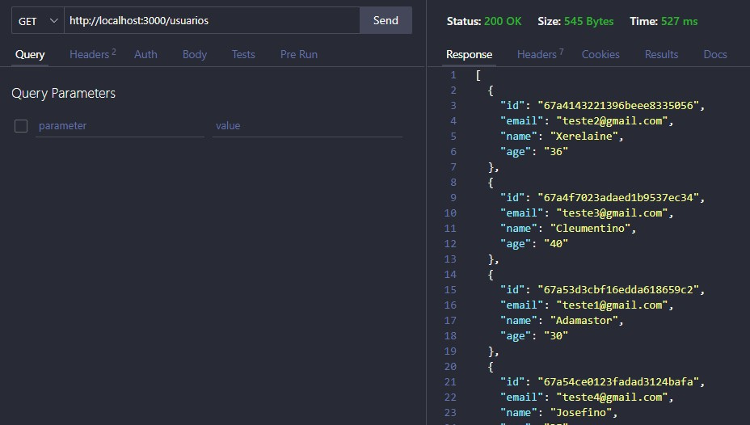

# PROJETO FULL STACK
## Projeto : Cadastro de Clientes 
### ( Parte 1 - Backend  API )
 

### ⭕ Descrição 📝
Projeto desenvolvido para trabalhar em conjunto com o front-end, na criação, edição, deletando e listando usuários no banco de dados.

Nessa Parte do projeto foi desenvolvido a parte da API, a manipulação desses dados, a sua filtragem.

### ⭕ Tecnologias usadas 🖥️
node.js -> permitiu executar JavaScript no servidor.
express -> simplificr a construção das aplicações e APIs.
prisma -> facilitar a interação com bancos de dados
axios -> Para fazer requisições HTTP 
mongoDB -> banco de dados NoSQL usado para armazenar os dados
cors -> mecanismo de segurança que permitiu a cominicação restrita em uma página da web que seja solicitada de um domínio diferente

### ⭕ Dificuldades encontradas ⚒️
Como sempre a manipilação te tecnologias nunca usadas é sempre o maior desafio, e dessa vez foi o mongoDb, pois até entao so usava o PostgreSQL.

